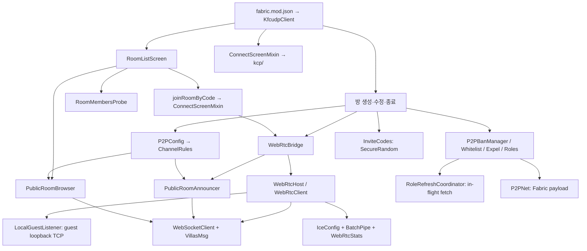

# Instant P2P 코드 트리와 분리 지도

이 문서는 포크의 코드를 찾고 작은 단위로 분리하기 위한 지도다. 과거 기준은 포크 커밋 `684508b`의 **Java 50개·15,961행** 인벤토리다. 아래 물리적 트리는 현재 **Java 54개**를 기록한다. 과거 줄 수는 빈 줄·주석과 Stonecutter 조건 분기를 포함하며, 현재 줄 수로 해석하면 안 된다. 이 트리는 소스 구조의 설명이며 Minecraft에서의 동작 검증 결과가 아니다.

## 물리적 파일 트리

```text
.
├─ .github/workflows/
│  ├─ build.yml                             17개 Minecraft 대상의 CI 빌드
│  └─ verify-repository.yml                 저장소 구조·순수 Java 계약 CI
├─ build.gradle.kts                         1.21.x Yarn/remap/Java 21
├─ build-26x.gradle.kts                     26.x Mojang 매핑/no-remap/Java 25
├─ settings.gradle.kts                      Stonecutter 버전 노드
├─ stonecutter.gradle.kts                   빌드·JAR 수집 태스크
├─ stonecutter.properties.toml             공통 모드 버전·대상별 의존성
├─ gradle.properties                        Loader·빌드 설정
├─ gradle/wrapper/                           Gradle wrapper
├─ .agents/skills/instant-p2p-maintainer/   이 포크의 AI 유지보수 스킬(원본)
│  └─ SKILL.md
├─ .claude/skills/instant-p2p-maintainer/   Claude Code 탐색용 진입점, 원본을 가리킴
│  └─ SKILL.md
├─ docs/research/                           연구 기록
│  ├─ code-tree.md
│  ├─ compatibility-and-modpack.md
│  ├─ feature-role-optimization.md
│  ├─ verification-tools.md
│  └─ work-guides/                          제안별 독립 가이드
├─ tools/                                   저장소·순수 Java 검증 도구
│  ├─ verify/
│  └─ tests/
└─ src/
   ├─ main/resources/
   │  ├─ fabric.mod.json                    진입점·대상별 필수 의존성
   │  └─ assets/instant-p2p/
   │     ├─ icon.png
   │     ├─ lang/{ko_kr,en_us}.json         화면·메시지 번역
   │     └─ textures/gui/sprites/
   │        ├─ chzzk.png
   │        ├─ cime.png
   │        ├─ twitch.png
   │        └─ youtube.png
   └─ client/
      ├─ resources/instant-p2p.client.mixins.json
      └─ java/kfc/udp/client/
         ├─ KfcudpClient.java               Fabric 진입점·방 생명주기·이벤트 등록
         ├─ ChatHideSync.java               채팅 숨김 동기화
         ├─ DevBadge.java                   역할/배지 표시
         ├─ gui/                             게임 화면 7개
         │  ├─ BlockedPlayersScreen.java    차단·온라인 목록
         │  ├─ ChannelScreen.java           채널 설정
         │  ├─ ChzzkLinkScreen.java         치지직 연동
         │  ├─ ConfirmPopup.java            방 목록 내 확인 팝업
         │  ├─ CustomRoomScreen.java        방 생성·설정
         │  ├─ RoomListScreen.java          목록·필터·입장
         │  └─ SafetyWarningScreen.java     연결 전 안내
         ├─ kcp/                             WebRTC 초대방과 별도인 KCP 접속 경로 6개
         │  ├─ KcpAddressRegistry.java
         │  ├─ KcpChannel.java
         │  ├─ KcpCore.java
         │  ├─ KcpException.java
         │  ├─ KcpExceptionHandler.java
         │  └─ KcpOutput.java
         ├─ mixin/                           Minecraft 접점 14개
         │  ├─ ClientConnectionMixin.java
         │  ├─ CommandNodeAccessor.java
         │  ├─ ConnectScreenMixin.java
         │  ├─ DevBadgeMixin.java
         │  ├─ DevNameMixin.java
         │  ├─ IntegratedServerAccessor.java
         │  ├─ IntegratedServerMaxPlayersMixin.java
         │  ├─ IntegratedServerStopMixin.java
         │  ├─ PlayerJoinMessageMixin.java
         │  ├─ PlayerManagerAccessor.java
         │  ├─ PlayerManagerMixin.java
         │  ├─ ServerAddressMixin.java
         │  ├─ ServerDisconnectStopMixin.java
         │  └─ SocialHideMixin.java
         └─ webrtc/                          연결·정책·공개 방 24개
            ├─ BatchPipe.java              DataChannel → TCP 배칭·배압
            ├─ ChannelRules.java           채널 파싱·조합·공개 방 표시 규칙 [추출]
            ├─ ChzzkLink.java              외부 계정 연동
            ├─ ExpelManager.java           추방·강퇴
            ├─ IceConfig.java              ICE 후보·TURN 정책
            ├─ InviteCodes.java            기존 10자 코드 형식의 보안 난수 생성
            ├─ LocalGuestListener.java     IPv4 루프백 TCP 리스너·포트 소유
            ├─ P2PBanManager.java          차단 저장·입장 판정·명령어·터널 IP
            ├─ P2PConfig.java              주소·버전·사용자 설정·로비 ID
            ├─ P2PNet.java                 게임 내 Fabric 페이로드
            ├─ P2PWhitelistManager.java    화이트리스트
            ├─ PublicRoomAnnouncer.java    공개 방 공지
            ├─ PublicRoomBrowser.java      공개 방 구독·목록 데이터
            ├─ RoleRefreshCoordinator.java 진행 중 역할 조회 공유·시간 제한
            ├─ Roles.java                  서명된 역할 조회
            ├─ RoomMembersProbe.java       입장 전 방 참가자 조회
            ├─ RoomRoles.java              방 역할·상태
            ├─ SignalingRtt.java           시그널링 왕복 시간
            ├─ VillasMsg.java              시그널링 JSON 형식
            ├─ WebRtcBridge.java           호스트·게스트·공지 생명주기
            ├─ WebRtcClient.java           게스트 RTC·로컬 TCP 터널
            ├─ WebRtcHost.java             호스트 RTC·통합 서버 TCP 터널
            ├─ WebRtcStats.java            직결/중계 진단
            └─ WebSocketClient.java        시그널링 WebSocket 전송
```

## 실행·의존 관계



`VillasMsg`는 **시그널링 서버와 교환하는 JSON**, `P2PNet`은 **게임 내부 Fabric 페이로드**다. 공개 방 목록의 차단 해시 필터와 실제 호스트의 `P2PBanManager.checkCanJoin`도 역할이 다르다. `kcp/`는 Netty에 의존하지만 일반 WebRTC 초대방의 터널은 아니다. 시그널링/TURN 서버 구현은 이 저장소 밖에 있다.

## 분리 현황과 다음 경계

아래는 **제안하는 책임 트리**다. `ChannelRules`, `InviteCodes`, `LocalGuestListener`, `RoleRefreshCoordinator`는 현재 별도 파일로 존재한다. 나머지는 기존 파일을 어느 방향으로 나눌지 가리키는 작업 단위다. 파일 추출과 순수 Java 검사 결과만으로 게임 안에서의 연결·입장 동작을 확정하지 않는다. 버전별 Java 소스를 복제하기 전에 공통 규칙과 Minecraft API 접점을 분리한다.

```text
Instant P2P
├─ 진입·Minecraft 연동       KfcudpClient, mixin/, P2PNet
├─ 화면·입력                gui/
│  └─ 목록 표시 상태        RoomListScreen에서 분리 후보
├─ 방 설정·발견
│  ├─ 채널 규칙              ChannelRules [완료]
│  ├─ 초대 코드 생성          InviteCodes [부분 구현]
│  ├─ 설정 저장·로비 ID      P2PConfig에서 분리 후보
│  └─ 공개 방 공지·조회      PublicRoomAnnouncer / PublicRoomBrowser / RoomMembersProbe
├─ 시그널링·전송
│  ├─ JSON 계약·WebSocket   VillasMsg / WebSocketClient / SignalingRtt
│  ├─ 세션 생명주기          WebRtcBridge / WebRtcHost / WebRtcClient
│  ├─ 게스트 로컬 리스너      LocalGuestListener [부분 구현]
│  └─ 데이터·ICE 진단       BatchPipe / IceConfig / WebRtcStats
├─ 입장 정책·역할           P2PBanManager / P2PWhitelistManager / ExpelManager / Roles / RoomRoles
│  └─ 조회 동시성·시간 제한   RoleRefreshCoordinator [부분 구현]
└─ 별도 KCP 경로            kcp/
```

각 작업 단위는 공개 API, 저장 형식, 상대 피어와 주고받는 형식을 먼저 확인한 뒤 이동한다. 특히 방 목록 표시 상태를 분리해도 호스트 입장 판정의 소유자는 바뀌지 않는다.

| 상태 | 경계 | 이유와 유지할 계약 |
|---|---|---|
| **EXTRACTED** | `P2PConfig` → `ChannelRules` | 순수 채널 파싱·AND/OR 판정을 별도 클래스로 옮기고 기존 공개 API는 위임해 호출자를 유지한다. |
| **PARTIAL** | `WebRtcClient` → `LocalGuestListener` | 게스트 리스너를 IPv4 루프백에서 직접 확보하고 사용 중인 기본 포트에서는 OS가 대체 포트를 고른다. 별도 빈 포트 탐색을 없애 소켓 소유와 전달 포트를 연결했다. 순수 Java 소켓 검사와 실게임 연결 검증은 서로 구분한다. |
| **PARTIAL** | `KfcudpClient` → `InviteCodes` | 기존 32자 집합에서 10자를 고르는 형식은 유지하며 생성기를 `SecureRandom`으로 옮겼다. 형식 검사는 예측 저항성의 증명이 아니다. |
| **PARTIAL** | `Roles` → `RoleRefreshCoordinator` | 진행 중 조회를 공유하되 완료된 응답은 다음 만실 로그인에 재사용하지 않는다. 정원이 남으면 비동기 조회, 만실이면 최대 700ms 동안 이번 HTTP 요청에서 받은 서명 유효 응답을 기다린다. 실패·시간 초과 때 기존 캐시 특혜로 만실을 우회하지 않는다. 응답에 nonce·시각 검증이 없어 과거의 정상 서명 응답 재생까지 막지는 못한다. 실제 서버 틱·역할 UI도 미검증이다. |
| **PLANNED** | `P2PConfig`의 설정 저장과 공개 로비 ID 계산 | 설정 파일 갱신은 하나의 소유자로 두고, 로비 ID의 모드 버전 해시·채널 해시·샤드 계산은 기존 경로와 바이트 단위로 같아야 한다. |
| **PLANNED** | `RoomListScreen`의 표시 목록 상태 | 목록 스냅샷·정렬·삭제 유예를 화면 렌더와 분리한다. 현재 1.5초 유예와 `hideOtherVersions` 동작을 보존한다. |
| **PLANNED** | `KfcudpClient`의 방 생명주기와 Minecraft API 어댑터 | 1.21.x/26.x 분기가 많은 진입점이다. 이벤트 등록 순서와 방 종료·재접속 경로를 먼저 고정한다. |
| **PLANNED** | `WebRtcHost`·`WebRtcClient`의 시그널링 세션과 데이터 터널 | 조기 Minecraft 바이트, 대기 ICE, 직결→TURN 재시도, 배압 및 종료 소유권을 보존한다. |
| **PLANNED** | `P2PBanManager`의 저장·실제 입장 판정·명령어 | 하나의 차단 데이터 원천을 유지하고 서버 입장 판정을 화면 필터로 대체하지 않는다. |

기준 인벤토리에서 가장 큰 파일은 `KfcudpClient` 1,897행, `RoomListScreen` 1,568행, `P2PBanManager` 1,027행, `CustomRoomScreen` 982행, `BlockedPlayersScreen` 930행이다. Java 파일 30개에는 Stonecutter 조건 분기가 있고, 분기 지점 282곳 중 다섯 파일에 약 57%가 모여 있다. 이 수치는 분리 우선순위를 고르는 참고값이며 변경 후 최신 값은 다시 측정해야 한다.

`WebRtcBridge → PublicRoomAnnouncer → P2PBanManager → WebRtcBridge`와 `WebSocketClient ↔ SignalingRtt`의 호출 순환이 있다. 파일을 더 나눌 때 이 순환을 새 패키지 간 양방향 의존으로 그대로 옮기지 말고 이벤트·좁은 인터페이스 경계를 검토한다. 공개 로비 ID, `VillasMsg`의 필드명·delta 처리, Fabric payload ID는 외부/버전 간 계약이므로 겉으로 보이는 구조 변경을 별도로 검증해야 한다.

## 검증 경계

[`settings.gradle.kts`](../../settings.gradle.kts)와 [CI 매트릭스](../../.github/workflows/build.yml)는 17개 대상 목록을 각각 가진다. 새 Minecraft 버전을 추가할 때 둘을 함께 갱신한다. 공통 Java 코드의 분리에서는 적어도 1.21.x와 26.x의 대표 빌드를 확인하고, 배포 수준의 호환성 주장은 전체 빌드와 실제 호스트·게스트 실행 근거를 따로 요구한다. 저장소의 [검증 도구](verification-tools.md)는 구조와 일부 순수 Java 계약을 확인한다. 실제 Minecraft 호스트·게스트 연결 검증은 별도로 기록해야 한다.

01~03의 현재 부분 구현을 포함한 로컬 개발 체크아웃에서 JDK 25·Gradle 9.7.1로 `:1.21:build`와 `:26.2:build`가 각각 성공했다(`--configure-on-demand --offline --no-daemon`). 1.21에는 기존 `CommandNodeAccessor` 매핑 경고, 26.2에는 deprecated API 알림, 두 빌드에는 Gradle 10 호환성 관련 deprecated 기능 경고가 있었다. 이는 두 대표 대상의 컴파일 근거다. 현재 변경을 포함한 전체 17개 대상 빌드와 실제 Minecraft 방장·게스트 연결은 아직 검증하지 않았다. [작업 가이드 01~03](work-guides/README.md)에 각 변경의 실행 게이트를 기록한다.
